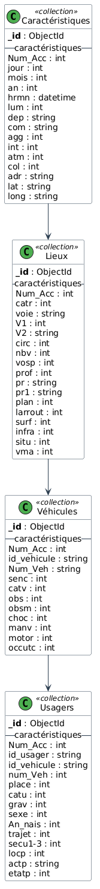
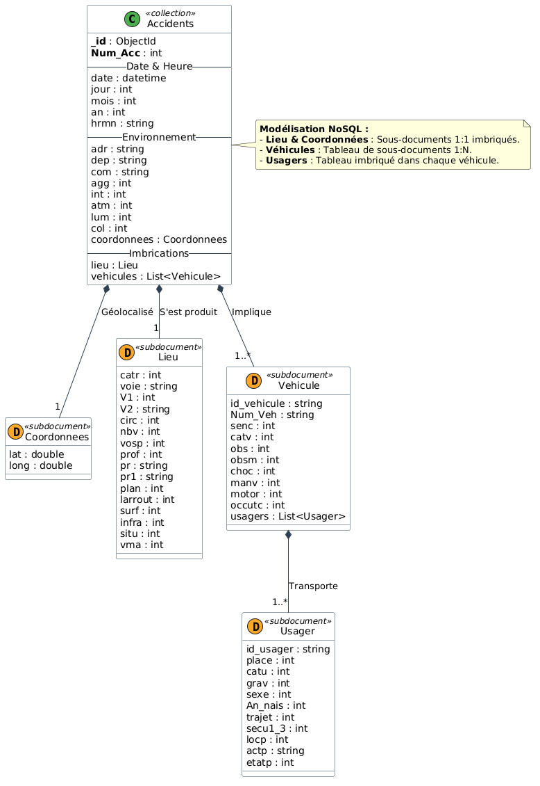
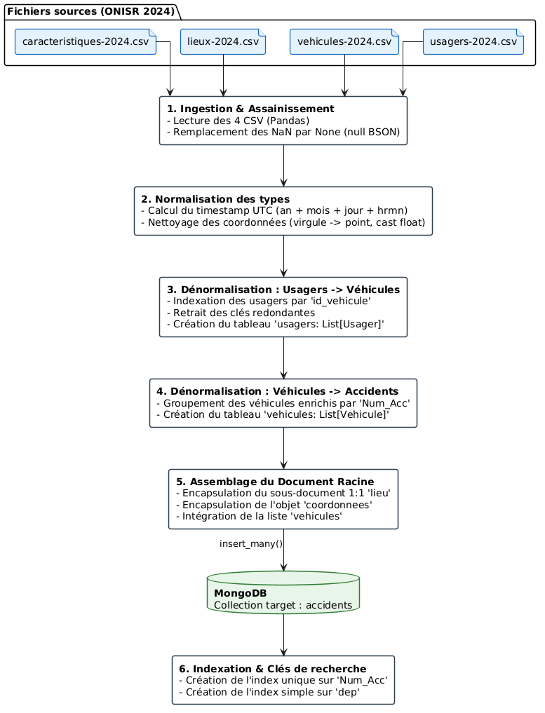
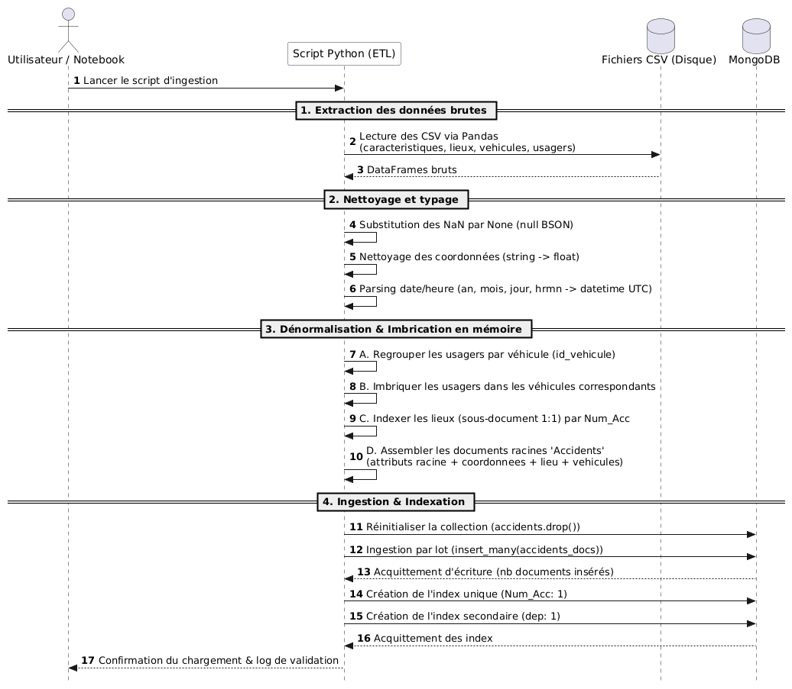

# Conception, Modélisation et Exploitation d'une Base NoSQL MongoDB
## Architecture de Données, Indexation & Analyse Décisionnelle sur les Accidents Routiers (BAAC 2024)

**MIA4 · NEEKOCODE × IPSSI**  
**Projet Final d'Architecture NoSQL**

---

## Table des Matières

1. [Contexte Métier & Présentation du Projet](#1-contexte-métier--présentation-du-projet)
2. [Stack Technique & Architecture Système](#2-stack-technique--architecture-système)
3. [Guide de Déploiement & Reproductibilité](#3-guide-de-déploiement--reproductibilité)
   - [3.1. Prérequis & Environnement de Développement](#31-prérequis--environnement-de-développement)
   - [3.2. Initialisation Automatisée avec `uv`](#32-initialisation-automatisée-avec-uv)
   - [3.3. Configuration Sécurisée des Variables d'Environnement](#33-configuration-sécurisée-des-variables-denvironnement)
   - [3.4. Démarrage des Instances MongoDB (Atlas & Local)](#34-démarrage-des-instances-mongodb-atlas--local)
   - [3.5. Validation Automatisée de l'Environnement](#35-validation-automatisée-de-lenvironnement)
   - [3.6. Exécution des Livrables](#36-exécution-des-livrables)
4. [Livrables 1 & 2 : Modélisation NoSQL & Justifications Architecturales](#4-livrables-1--2--modélisation-nosql--justifications-architecturales)
   - [4.1. Jeu de Données Source (ONISR BAAC 2024)](#41-jeu-de-données-source-onisr-baac-2024)
   - [4.2. Schéma Relationnel Initial vs Schéma Document Cible](#42-schéma-relationnel-initial-vs-schéma-document-cible)
   - [4.3. Fiche de Modélisation & Justification des Arbitrages](#43-fiche-de-modélisation--justification-des-arbitrages)
   - [4.4. Pipeline ETL, Assainissement & Dénormalisation](#44-pipeline-etl-assainissement--dénormalisation)
5. [Livrable 3 : Module CRUD Python & Gestion Robuste des Exceptions](#5-livrable-3--module-crud-python--gestion-robuste-des-exceptions)
   - [5.1. Implémentation des Opérations CRUD](#51-implémentation-des-opérations-crud)
   - [5.2. Stratégie de Résilience & Traitement des Erreurs PyMongo](#52-stratégie-de-résilience--traitement-des-erreurs-pymongo)
6. [Livrable 4 : Stratégie d'Indexation & Évaluation des Performances (Explain Plans)](#6-livrable-4--stratégie-dindexation--évaluation-des-performances-explain-plans)
   - [6.1. Protocole de Mesure & Benchmark Comparatif](#61-protocole-de-mesure--benchmark-comparatif)
   - [6.2. Analyse Détaillée des Index Implémentés](#62-analyse-détaillée-des-index-implémentés)
   - [6.3. Tableau Récapitulatif des Gains d'Exécution](#63-tableau-récapitulatif-des-gains-dexécution)
   - [6.4. Analyse des Coûts de Maintenance et d'Écriture](#64-analyse-des-coûts-de-maintenance-et-décriture)
7. [Livrable 5 : Rapport Analytique par Agrégations Décisionnelles](#7-livrable-5--rapport-analytique-par-agrégations-décisionnelles)
   - [7.1. Contrôle & Déduplication Préalable](#71-contrôle--déduplication-préalable)
   - [7.2. Analyse 1 — Variabilité Temporelle de la Mortalité (Heure × Semaine / Week-end)](#72-analyse-1--variabilité-temporelle-de-la-mortalité-heure--semaine--week-end)
   - [7.3. Analyse 2 — Vulnérabilité des Usagers selon le Mode de Déplacement](#73-analyse-2--vulnérabilité-des-usagers-selon-le-mode-de-déplacement)
   - [7.4. Analyse 3 — Typologie d'Infrastructure Routière vs Taux de Mortalité](#74-analyse-3--typologie-dinfrastructure-routière-vs-taux-de-mortalité)
   - [7.5. Synthèse des Opérateurs d'Agrégation Maîtrisés](#75-synthèse-des-opérateurs-dagrégation-maîtrisés)
   - [7.6. Limites Statistiques & Biais de Déclaration](#76-limites-statistiques--biais-de-déclaration)
8. [Livrable 6 : Administration Système, Sauvegardes & Continuité d'Activité](#8-livrable-6--administration-système-sauvegardes--continuité-dactivité)
   - [8.1. Procédures `mongodump` & `mongorestore`](#81-procédures-mongodump--mongorestore)
   - [8.2. Automatisation Industrielle par Script Dédié et Tâche Cron](#82-automatisation-industrielle-par-script-dédié-et-tâche-cron)
   - [8.3. Protocole de Validation Croisée Atlas ↔ Local](#83-protocole-de-validation-croisée-atlas--local)
9. [Structure et Cartographie du Dépôt](#9-structure-et-cartographie-du-dépôt)
10. [Sécurité & Bonnes Pratiques](#10-sécurité--bonnes-pratiques)
11. [Guide de Défense pour la Soutenance](#11-guide-de-défense-pour-la-soutenance)

---

## 1. Contexte Métier & Présentation du Projet

Dans le cadre du module **Conception et intégration d'une base de données NoSQL**, ce projet met en œuvre une chaîne complète d'ingénierie de données autour de **MongoDB** (Cloud managé Atlas M0 et conteneur Docker local) en s'appuyant sur un jeu de données réel : le **Bulletin d'Analyse des Accidents Corporels de la circulation (BAAC 2024)** publié par l'Observatoire National Interministériel de la Sécurité Routière (**ONISR** / *data.gouv.fr*).

### Objectifs Clés Réalisés
- **Ingestion & Dénormalisation :** Transition d'un modèle relationnel en 4 tables vers un modèle orienté document unifié (> 54 000 documents) optimisé pour les accès dominants.
- **Déploiement Cloud & Local :** Base de production instanciée sur MongoDB Atlas (accessible en ligne) et réplicable localement sous Docker.
- **Développement CRUD :** Driver Python (`pymongo`) interfacé avec gestion granulaire des erreurs et modularité.
- **Indexation Stratégique :** Benchmark systématique `COLLSCAN` vs `IXSCAN` (index simple, composé, multikey et géospatial 2dsphere) avec réduction supérieure à 94% des documents examinés.
- **Pipelines d'Agrégation Avancés :** Réponses à des problématiques métier décisionnelles avec visualisations graphiques.
- **Administration & Résilience :** Stratégie de sauvegarde/restauration automatisée via `mongodump`, `mongorestore` et scripts `cron`.

---

## 2. Stack Technique & Architecture Système

| Composant | Technologie retenue | Rôle dans l'architecture |
| :--- | :--- | :--- |
| **SGBD NoSQL** | **MongoDB 8.x** (Atlas Cloud & Docker local) | Stockage orienté documents BSON, indexation, moteur d'agrégation |
| **Langage & Environnement** | **Python `>= 3.12`** | Scripts ETL, module CRUD, benchmarks et calculs analytiques |
| **Gestionnaire de Paquets** | [`uv`](https://github.com/astral-sh/uv) (Astral) | Résolution de dépendances et synchronisation déterministe via `uv.lock` |
| **Driver Base de Données** | `pymongo[srv] >= 4.17` | Connexion client avec résolution DNS SRV pour cluster Atlas |
| **Traitement & Analyse** | `pandas >= 3.0`, `numpy` | Manipulation tabulaire lors de l'ETL, restitution tabulaire |
| **Visualisation Graphique** | `matplotlib >= 3.11`, `seaborn` | Restitution graphique des agrégations métier |
| **Outils CLI MongoDB** | `mongosh`, `mongodb-database-tools` | Administration shell, ingestion brute, `mongodump`, `mongorestore` |
| **Configuration Sécurisée** | `python-dotenv >= 1.2` | Isolation des secrets et chaînes de connexion dans `.env` / `.env.local` |

---

## 3. Guide de Déploiement & Reproductibilité

Ce guide permet à tout examinateur de déployer l'environnement et de reproduire l'intégralité des résultats sans intervention manuelle sur le code.

### 3.1. Prérequis & Environnement de Développement

Assurez-vous de disposer des outils suivants :
1. **Python `>= 3.12`**
2. **Le gestionnaire `uv` :**
   - *Linux / macOS :* `curl -LsSf https://astral.sh/uv/install.sh | sh`
   - *Windows (PowerShell) :* `powershell -ExecutionPolicy ByPass -c "irm https://astral.sh/uv/install.ps1 | iex"`
3. **MongoDB Shell & Database Tools :**
   - *macOS (Homebrew) :* `brew install mongosh mongodb/brew/mongodb-database-tools`
   - *Linux (Debian/Ubuntu) :* installation des paquets officiels `mongodb-mongosh` et `mongodb-database-tools`.
   - *Windows :* `winget install MongoDB.Shell` et installation des Database Tools depuis le portail officiel MongoDB.
4. **Docker (optionnel, pour l'instance locale) :** Docker Engine / Docker Desktop.

### 3.2. Initialisation Automatisée avec `uv`

Clonez le dépôt et synchronisez les dépendances verrouillées :

```bash
# 1. Cloner le projet
git clone https://github.com/LeoLChalot/ipssi-nosql.git
cd ipssi-nosql

# 2. Synchroniser l'environnement virtuel (.venv) à l'état exact défini dans uv.lock
uv sync
```

### 3.3. Configuration Sécurisée des Variables d'Environnement

Le projet sépare strictement le code applicatif des identifiants sensibles :

1. Créez votre fichier `.env` ou `.env.local` à partir du gabarit `.env.example` :
   ```bash
   cp .env.example .env.local
   ```
2. Renseignez les URI de connexion :
   ```env
   # Connexion Cloud MongoDB Atlas
   ATLAS_URI="mongodb+srv://<utilisateur>:<mot_de_passe>@cluster0.xxxxx.mongodb.net/?retryWrites=true&w=majority"

   # Connexion Locale (Docker / MongoDB natif)
   LOCAL_URI="mongodb://localhost:27017"
   ```
3. Vérifiez que `.env` et `.env.local` sont bien exclus du versionnage (`git status`).

### 3.4. Démarrage des Instances MongoDB (Atlas & Local)

- **Cluster Cloud Atlas :** Vérifiez que l'adresse IP de votre machine est autorisée dans l'onglet *Network Access* (ou `0.0.0.0/0` en phase d'évaluation) et que l'utilisateur dispose des droits de lecture/écriture sur `securite_routiere`.
- **Instance Docker Locale :**
  ```bash
  docker run -d --name mongo8 -p 27017:27017 -v mongo8_data:/data/db mongo:8
  ```

### 3.5. Validation Automatisée de l'Environnement

Un script de test unitaire de l'environnement est fourni dans `setup/check_setup.py`. Exécutez :

```bash
uv run python setup/check_setup.py
```

**Sortie attendue :**
```text
====================================================
  MIA4 NoSQL - verification de l'environnement
====================================================
Python  : 3.14.x (ou >= 3.12)
pymongo : 4.17.x
OK      : mongosh trouve
OK      : mongoimport trouve
OK      : mongodump trouve
----------------------------------------------------
OK      : Atlas joignable, MongoDB 8.0.x
OK      : Local joignable, MongoDB 8.x
----------------------------------------------------
VERDICT : Setup complet. Vous êtes pret pour travailler.
====================================================
```

### 3.6. Exécution des Livrables

Les notebooks et scripts peuvent être lancés directement via `uv` :

| Livrable | Fichier principal | Commande d'exécution |
| :--- | :--- | :--- |
| **Livrables 1 & 2 (ETL & Schéma)** | `notebook_livrable_1_2_ingestion_dataset.ipynb` | `uv run jupyter lab` ou exécution dans VS Code / Cursor |
| **Livrables 3 & 6 (CRUD & Backup)** | `notebookCrud_BackUp.ipynb` | Exécution des cellules avec sorties conservées |
| **Livrable 4 (Index & Explain)** | `notebook_livrable_4_indexes.ipynb` | Benchmark systématique avant/après |
| **Livrable 5 (Agrégations)** | `notebook_livrable_5_aggregations.ipynb` | Pipelines décisionnels et visualisations |
| **Script d'Administration Cron** | `scripts/weekly_backup.py` | `uv run python scripts/weekly_backup.py` |

---

## 4. Livrables 1 & 2 : Modélisation NoSQL & Justifications Architecturales

### 4.1. Jeu de Données Source (ONISR BAAC 2024)

Le dataset source comprend 4 tables relationnelles normalisées :
1. `caracteristiques-2024.csv` : CIRCONSTANCES GÉNÉRALES (date, heure, météo, luminosité, adresse, coordonnées GPS).
2. `lieux-2024.csv` : INFRASTRUCTURE ROUTIÈRE (catégorie de route, régime de circulation, nombre de voies, vitesse max).
3. `vehicules-2024.csv` : VÉHICULES IMPLIQUÉS (catégorie, motorisation, point de choc, manœuvre).
4. `usagers-2024.csv` : PERSONNES IMPLIQUÉES (gravité des blessures, sexe, année de naissance, place, équipement de sécurité).

### 4.2. Schéma Relationnel Initial vs Schéma Document Cible

#### Modèle Relationnel Initial (4 Collections/Tables distinctes)
Dans un SGBD relationnel classique, ces entités sont reliées par des clés étrangères (`Num_Acc` et `id_vehicule`), imposant 3 jointures coûteuses pour reconstituer la scène d'un accident.



#### Modèle NoSQL Cible Dénormalisé (1 Collection Unifiée : `accidents`)
Dans MongoDB, l'accident constitue l'unité atomique d'agrégation. L'infrastructure routière et les coordonnées sont intégrées en sous-documents 1:1, tandis que les véhicules et les usagers sont encapsulés sous forme de tableaux imbriqués hiérarchiquement.



#### Schéma BSON Document Type

```json
{
  "_id": ObjectId("6a9138461870d91314453898"),
  "Num_Acc": 202400000001,
  "date": ISODate("2024-03-25T07:40:00.000Z"),
  "jour": 25,
  "mois": 3,
  "an": 2024,
  "hrmn": "07:40",
  "dep": "70",
  "com": "70285",
  "agg": 1,
  "int": 1,
  "atm": 5,
  "lum": 2,
  "col": 1,
  "adr": "D438",
  "localisation": {
    "type": "Point",
    "coordinates": [6.75832, 47.56277]
  },
  "lieu": {
    "catr": 3,
    "voie": "D438",
    "circ": 2,
    "nbv": 2,
    "vosp": 0,
    "prof": 1,
    "pr": "1",
    "pr1": "260",
    "plan": 2,
    "larrout": 7,
    "surf": 1,
    "infra": 0,
    "situ": 1,
    "vma": 90
  },
  "vehicules": [
    {
      "id_vehicule": "155781758",
      "Num_Veh": "A01",
      "catv": 7,
      "motor": 1,
      "choc": 1,
      "manv": 13,
      "senc": 1,
      "obs": 0,
      "obsm": 2,
      "usagers": [
        {
          "id_usager": "203988581",
          "place": 1,
          "catu": 1,
          "grav": 3,
          "sexe": 1,
          "An_nais": 1985,
          "trajet": 2,
          "secu1": 1,
          "secu2": -1,
          "secu3": -1,
          "locp": -1,
          "actp": "-1",
          "etatp": -1
        }
      ]
    }
  ]
}
```

### 4.3. Fiche de Modélisation & Justification des Arbitrages

| Relation source | Cardinalité | Implémentation MongoDB | Question directrice & Justification | Ce que ça coûte (Trade-off architectural) |
| :--- | :---: | :--- | :--- | :--- |
| **Accident ↔ Lieu** | **1 — 1** | **Sous-document imbriqué** `lieu` | *Accède-t-on au lieu séparément de l'accident ?* Non, le lieu est indissociable du constat d'accident. L'imbrication évite une collection dédiée et supprime un `$lookup`. | Légère duplication si plusieurs accidents surviennent exactement au même point kilométrique (négligeable en pratique). |
| **Accident ↔ Coordonnées** | **1 — 1** | **Sous-document GeoJSON** `localisation` : `Point [long, lat]` | *Comment permettre des requêtes spatiales natives ?* La normalisation GeoJSON au standard `[longitude, latitude]` permet d'activer un index spatial `2dsphere` et l'opérateur `$geoWithin` / `$near`. | Format strict imposant la conversion des chaînes séparées par virgules en flottants lors de l'ETL. |
| **Accident ↔ Véhicules** | **1 — N** *(borné)* | **Tableau de sous-documents** `vehicules: List[Object]` | *Le volume de véhicules peut-il saturer un document ?* Un accident implique 1 à 5 véhicules en moyenne (rarement > 10). La cardinalité est strictement bornée, éliminant tout risque de dépasser la limite de 16 Mo par document BSON. | Une mise à jour concurrente sur deux véhicules du même accident verrouille le document racine. |
| **Véhicule ↔ Usagers** | **1 — N** *(borné)* | **Tableau imbriqué hiérarchiquement** `vehicules[].usagers: List[Object]` | *Comment modéliser la réalité physique ?* Chaque usager est rattaché au véhicule qui le transporte (ou heurté par lui pour un piéton). Cela permet d'interroger directement la gravité des occupants par type de véhicule sans jointure. | Complexifie légèrement l'écriture des pipelines d'agrégation (nécessite deux `$unwind` successifs pour analyser l'usager individuellement). |

### 4.4. Pipeline ETL, Assainissement & Dénormalisation

Le processus d'ingestion automatisé (`notebook_livrable_1_2_ingestion_dataset.ipynb`) réalise l'extraction, le nettoyage et l'assemblage en mémoire avant insertion :

1. **Assainissement des types :** Remplacement des valeurs manquantes `NaN` par `None` (null BSON), conversion des coordonnées textuelles avec virgule (`"48,8566"`) en flottants standard (`48.8566`).
2. **Construction temporelle :** Conversion de `an`, `mois`, `jour`, `hrmn` en objet `datetime` ISO natif avec timezone UTC.
3. **Hiérarchisation en mémoire :** Indexation des usagers par `id_vehicule`, intégration des usagers dans les véhicules, puis indexation des véhicules et lieux par `Num_Acc`.
4. **Insertion par lot :** Ingestion en masse via `insert_many()` dans la collection finale `securite_routiere.accidents` (54 402 documents).

#### Diagramme de Flux de Transformation


#### Diagramme de Séquence de l'Ingestion


---

## 5. Livrable 3 : Module CRUD Python & Gestion Robuste des Exceptions

Le livrable 3 (`notebookCrud_BackUp.ipynb`) implémente les 4 opérations fondamentales en Python avec gestion rigoureuse des erreurs via le module officiel `pymongo.errors`.

### 5.1. Implémentation des Opérations CRUD

```python
from pymongo.errors import DuplicateKeyError, PyMongoError

# 1. CREATE
def create_accident(document: dict):
    """Insère un nouvel accident avec capture des doublons de clé primaire."""
    try:
        result = accidents.insert_one(document)
        print(f"Inséré avec _id={result.inserted_id}")
        return result.inserted_id
    except DuplicateKeyError:
        print("Échec : un document avec cet _id existe déjà (DuplicateKeyError)")
    except PyMongoError as exc:
        print(f"Échec de l'insertion : {exc}")
    return None

# 2. READ
def read_accidents(filtre: dict, limite: int = 5) -> list:
    """Recherche sécurisée d'accidents selon filtre."""
    try:
        return list(accidents.find(filtre).limit(limite))
    except PyMongoError as exc:
        print(f"Échec de la lecture : {exc}")
        return []

# 3. UPDATE
def update_accident(num_acc: int, changements: dict) -> int:
    """Mise à jour partielle ciblée par Num_Acc via l'opérateur $set."""
    try:
        result = accidents.update_one({"Num_Acc": num_acc}, {"$set": changements})
        if result.matched_count == 0:
            print(f"Aucun accident trouvé avec Num_Acc={num_acc}")
        else:
            print(f"{result.modified_count} document(s) modifié(s)")
        return result.modified_count
    except PyMongoError as exc:
        print(f"Échec de la mise à jour : {exc}")
        return 0

# 4. DELETE
def delete_accident(num_acc: int, filtre_supplementaire: dict = None) -> int:
    """Suppression sécurisée d'un accident par Num_Acc."""
    filtre = {"Num_Acc": num_acc}
    if filtre_supplementaire:
        filtre.update(filtre_supplementaire)
    try:
        result = accidents.delete_one(filtre)
        if result.deleted_count == 0:
            print(f"Aucun accident trouvé avec Num_Acc={num_acc}")
        else:
            print(f"{result.deleted_count} document(s) supprimé(s)")
        return result.deleted_count
    except PyMongoError as exc:
        print(f"Échec de la suppression : {exc}")
        return 0
```

### 5.2. Stratégie de Résilience & Traitement des Erreurs PyMongo

Le code intègre des tests de robustesse démontrant que l'application ne plante jamais en cas de mauvaise manipulation :
- **Tentative d'insertion d'une clé dupliquée :** interception explicite de `DuplicateKeyError` (code d'erreur MongoDB `11000`), évitant l'arrêt inopiné du service.
- **Tentative de modification du champ immuable `_id` :** capture de `PyMongoError` (code `66`), retour contrôlé à `0` modification.
- **Requête avec opérateur syntaxiquement invalide :** capture de l'erreur `BadValue` (code `2`), renvoi d'une liste vide `[]` sécurisée.

---

## 6. Livrable 4 : Stratégie d'Indexation & Évaluation des Performances (Explain Plans)

Le livrable 4 (`notebook_livrable_4_indexes.ipynb` et `docs/indexes.md`) valide l'optimisation des requêtes par des mesures comparatives avant/après avec le profilage `executionStats`.

### 6.1. Protocole de Mesure & Benchmark Comparatif

Pour évaluer les gains sans impacter la base partagée par des suppressions d'index :
- **Mesure AVANT :** Exécution avec forçage de parcours de collection complet (`COLLSCAN`) via `hint={"$natural": 1}`.
- **Mesure APRÈS :** Exécution avec forçage de l'index créé (`IXSCAN`) via `hint="<nom_index>"`.

### 6.2. Analyse Détaillée des Index Implémentés

#### 1. `idx_num_acc` — Index Simple d'Identifiant Métier
- **Définition :** `col_accidents.create_index([("Num_Acc", 1)], name="idx_num_acc")`
- **Requête cible :** `{"Num_Acc": 202400034184}` (recherche directe d'un accident).
- **Justification :** Permet un accès ponctuel direct en $O(\log N)$ sans scanner la collection.
- **Résultats observés :**
  - *Avant :* Plan `COLLSCAN` | 54 407 documents examinés | 74 ms
  - *Après :* Plan `FETCH + IXSCAN` | 1 document examiné | 0 ms (< 1 ms)
  - **Gain :** **99,998 %** de réduction du volume examiné.

#### 2. `idx_dep_atm` — Index Composé Territorial & Météorologique
- **Définition :** `col_accidents.create_index([("dep", 1), ("atm", 1)], name="idx_dep_atm")`
- **Requête cible :** `{"dep": "75", "atm": 2}` (accidents à Paris sous pluie légère).
- **Justification de l'ordre :** Le champ `dep` est positionné en premier pour que son préfixe serve également les requêtes filtrant uniquement par département `{"dep": "75"}` (règle des préfixes d'index B-Tree). `dep` est stocké sous forme de chaîne pour préserver les codes alphanumériques (`2A`, `2B`).
- **Résultats observés :**
  - *Avant :* Plan `COLLSCAN` | 54 407 documents examinés | 46 ms
  - *Après :* Plan `FETCH + IXSCAN` | 641 documents examinés | 1 ms
  - **Gain :** **98,822 %** de réduction du volume examiné.

#### 3. `idx_usagers_gravite` — Index Multikey sur Structure Imbriquée
- **Définition :** `col_accidents.create_index([("vehicules.usagers.grav", 1)], name="idx_usagers_gravite")`
- **Requête cible :** `{"vehicules.usagers.grav": 2}` (accidents avec au moins un usager tué, code `grav=2`).
- **Justification :** Comme `vehicules` et `usagers` sont des tableaux imbriqués, MongoDB génère un index **multikey** (`isMultiKey: true`). Cet index indexe chaque élément du tableau et permet d'extraire instantanément les accidents graves sans parcourir les sous-documents en mémoire.
- **Résultats observés :**
  - *Avant :* Plan `COLLSCAN` | 54 407 documents examinés | 129 ms
  - *Après :* Plan `FETCH + IXSCAN` | 3 226 documents examinés | 5 ms
  - **Gain :** **94,071 %** de réduction du volume examiné.

#### 4. `idx_localisation_2dsphere` — Index Géospatial
- **Définition :** `col_accidents.create_index([("localisation", "2dsphere")], name="idx_localisation_2dsphere")`
- **Requête cible :** Recherche spatiale dans un rayon de 5 km autour de Notre-Dame de Paris :
  ```python
  {
      "localisation": {
          "$geoWithin": {
              "$centerSphere": [
                  [2.3522, 48.8566], # [longitude, latitude]
                  5 / 6378.1         # Rayon de 5 km converti en radians
              ]
          }
      }
  }
  ```
- **Justification :** L'index `2dsphere` exploite les coordonnées sphériques WGS84 au format GeoJSON standard.
- **Résultats observés :**
  - *Avant :* Plan `COLLSCAN` | 54 407 documents examinés | 103 ms
  - *Après :* Plan `FETCH + IXSCAN` | 4 421 documents examinés | 21 ms
  - **Gain :** **91,874 %** de réduction du volume examiné.

### 6.3. Tableau Récapitulatif des Gains d'Exécution

| Requête testée | Nom de l'index | Plan avant | Plan après | Docs retournés | Docs examinés (Avant) | Docs examinés (Après) | Réduction docs | Temps (Avant) | Temps (Après) |
| :--- | :--- | :---: | :---: | :---: | :---: | :---: | :---: | :---: | :---: |
| **Recherche par identifiant** | `idx_num_acc` | `COLLSCAN` | `FETCH + IXSCAN` | 1 | 54 407 | **1** | **99,998 %** | 74 ms | **< 1 ms** |
| **Filtre Département + Météo** | `idx_dep_atm` | `COLLSCAN` | `FETCH + IXSCAN` | 641 | 54 407 | **641** | **98,822 %** | 46 ms | **1 ms** |
| **Recherche Usagers Tués** | `idx_usagers_gravite` | `COLLSCAN` | `FETCH + IXSCAN` | 3 226 | 54 407 | **3 226** | **94,071 %** | 129 ms | **5 ms** |
| **Périmètre spatial (5 km)** | `idx_localisation_2dsphere` | `COLLSCAN` | `FETCH + IXSCAN` | 3 452 | 54 407 | **4 421** | **91,874 %** | 103 ms | **21 ms** |

### 6.4. Analyse des Coûts de Maintenance et d'Écriture

Une bonne architecture NoSQL n'indexe pas l'intégralité des champs :
- **Consommation RAM :** Chaque index réside en mémoire vive dans le cache WiredTiger. Multiplier les index réduit l'espace disponible pour les documents chauds.
- **Pénalité à l'écriture :** Lors de chaque insertion ou mise à jour (`insert_one`, `update_one`), MongoDB doit mettre à jour les arbres B-Tree de l'ensemble des index associés, ce qui dégrade le débit d'écriture (*write amplification*). Les 4 index retenus répondent strictement aux accès dominants du système.

---

## 7. Livrable 5 : Rapport Analytique par Agrégations Décisionnelles

Le livrable 5 (`notebook_livrable_5_aggregations.ipynb`) répond à trois problématiques majeures de sécurité routière. L'intégralité des calculs est exécutée côté serveur par le moteur d'agrégation MongoDB.

### 7.1. Contrôle & Déduplication Préalable

Afin de garantir l'intégrité statistique de la base partagée même en présence de doublons injectés lors des tests CRUD, un étage défensif est systématiquement injecté au début de chaque pipeline :

```python
deduplication = [
    {
        "$group": {
            "_id": "$Num_Acc",
            "accident": {"$first": "$$ROOT"}
        }
    },
    {"$replaceRoot": {"newRoot": "$accident"}}
]
```

### 7.2. Analyse 1 — Variabilité Temporelle de la Mortalité (Heure × Semaine / Week-end)

- **Problématique métier :** *La proportion d'usagers tués parmi les personnes accidentées varie-t-elle selon l'heure et la période de la semaine ?*
- **Pipeline MongoDB :**
  1. Déduplication par `Num_Acc`.
  2. Double `$unwind` sur `$vehicules` puis `$vehicules.usagers`.
  3. Extraction temporelle `$hour: "$date"` et `$dayOfWeek: "$date"`.
  4. Projection conditionnelle `$cond` : usagers tués (`grav == 2`) et classification en `Semaine` (lundi-vendredi) vs `Week-end` (samedi-dimanche).
  5. Regroupement `$group` par `(periode, heure)` avec sommation `$sum`.
  6. Calcul du pourcentage `$multiply: [{$divide: ["$usagers_tues", "$total_usagers"]}, 100]`.
- **Résultats clés :**
  - **Semaine :** Pic maximal de létalité à **03h00 du matin** avec **8,03 %** d'usagers tués (47 tués / 585 impliqués).
  - **Week-end :** Pic maximal de létalité à **02h00 du matin** avec **5,83 %** d'usagers tués (61 tués / 1 046 impliqués).
  - En journée (08h00 - 18h00), le volume d'accidents est maximal mais la part de tués reste basse (~2,0 % à 2,5 %), expliquée par la saturation du trafic urbain et des vitesses réduites.

### 7.3. Analyse 2 — Vulnérabilité des Usagers selon le Mode de Déplacement

- **Problématique métier :** *Quels modes de déplacement présentent la plus forte proportion d'usagers tués ou hospitalisés ?*
- **Définition de la gravité :** Issue grave définie par `grav = 2` (tué) ou `grav = 3` (blessé hospitalisé).
- **Classification `$switch` :**
  - Piétons : `catu == 3`
  - Vélos : `catv == 1`
  - Deux-roues motorisés : `catv ∈ [2, 30, 31, 32, 33, 34]`
  - Voitures légères : `catv == 7`
- **Résultats clés :**

| Mode de transport | Total usagers impliqués | Usagers graves (tués + hosp.) | Usagers tués | Part d'usagers graves (%) |
| :--- | :---: | :---: | :---: | :---: |
| **Deux-roues motorisés** | 18 851 | 6 739 | 782 | **35,75 %** |
| **Piétons** | 9 401 | 3 089 | 498 | **32,86 %** |
| **Vélos** | 5 095 | 1 404 | 201 | **27,56 %** |
| **Voitures légères** | 71 778 | 9 003 | 1 604 | **12,54 %** |

- **Interprétation :** Les deux-roues motorisés et les piétons présentent une vulnérabilité physique critique : plus d'un tiers des usagers impliqués subissent des séquelles lourdes ou mortelles, contre seulement 12,5 % pour les occupants de voitures protégés par l'habitacle.

### 7.4. Analyse 3 — Typologie d'Infrastructure Routière vs Taux de Mortalité

- **Problématique métier :** *Quels types de voies concentrent le plus grand volume d'accidents corporels et quelle part de ces accidents s'avère mortelle ?*
- **Point technique du pipeline (Conservation de l'unité accident) :** Après le dépliage des usagers, le pipeline ré-agrège par `Num_Acc` avec un opérateur `$max: {$cond: [{$eq: ["$grav", 2]}, 1, 0]}`. Dès lors qu'au moins un usager est tué, l'accident est qualifié de mortel (compté exactement 1 fois), avant de regrouper par `type_route` (`catr`).
- **Résultats clés :**

| Catégorie de route | Nombre total d'accidents | Accidents mortels | Part d'accidents mortels (%) |
| :--- | :---: | :---: | :---: |
| **Route départementale** | 17 071 | 1 582 | **9,27 %** |
| **Route nationale** | 3 416 | 272 | **7,96 %** |
| **Autoroute** | 4 728 | 210 | **4,44 %** |
| **Voie communale** | 22 910 | 669 | **2,92 %** |

- **Conclusion analytique :** Décorrélation nette entre volume et létalité. La **voie communale** concentre le plus grand nombre d'accidents corporels (22 910) mais affiche le taux de mortalité le plus faible (2,92 %) en raison de vitesses réduites. À l'inverse, la **route départementale** est la plus létale (9,27 % d'accidents mortels) en raison de vitesses plus élevées, d'absence de séparation centrale et de carrefours à niveau.

### 7.5. Synthèse des Opérateurs d'Agrégation Maîtrisés

Le rapport mobilise un ensemble complet d'opérateurs du pipeline MongoDB :
- `$unwind` : aplatissement des tableaux de sous-documents hiérarchiques.
- `$group` / `$replaceRoot` : déduplication et calculs statistiques multi-échelles.
- `$project` / `$multiply` / `$divide` : projection dynamique et normalisation de ratios.
- `$cond` / `$switch` / `$in` : logique conditionnelle et catégorisation métier.
- `$max` : calcul d'indicateurs booléens au niveau accident.
- `$hour` / `$dayOfWeek` : décomposition de composantes temporelles natives BSON.
- `$sort` : ordonnancement déterministe des résultats.

### 7.6. Limites Statistiques & Biais de Déclaration

Pour une présentation objective face au jury, plusieurs limites sont soulignées :
1. **Nature conditionnelle des taux :** Les pourcentages mesurent la gravité *une fois l'accident survenu*. Ils ne mesurent pas le risque intrinsèque d'avoir un accident, qui nécessiterait des données d'exposition (kilomètres parcourus, trafic moyen journalier).
2. **Champ du BAAC :** La base recense uniquement les accidents corporels ayant fait l'objet d'un procès-verbal ou rapport par les forces de l'ordre. Les accrochages purement matériels en sont exclus.
3. **Données administratives brutes :** Présence de valeurs non renseignées ou codées `-1` nécessitant des filtres explicites lors de l'ETL et des agrégations.

---

## 8. Livrable 6 : Administration Système, Sauvegardes & Continuité d'Activité

### 8.1. Procédures `mongodump` & `mongorestore`

L'administration s'appuie sur les outils binaires natifs BSON :

```bash
# Sauvegarde BSON complète de la base de production Atlas
mongodump --uri="mongodb+srv://<USER>:<PASS>@cluster0.xxxxx.mongodb.net" \
          --db=securite_routiere \
          --out=./backups/securite_routiere_$(date +%Y-%m-%d_%Hh%M)

# Restauration vers l'instance locale Docker (avec écrasement propre)
mongorestore --uri="mongodb://localhost:27017" \
             --nsInclude="securite_routiere.*" \
             --drop \
             ./backups/securite_routiere_2026-08-28_11h06/
```

### 8.2. Automatisation Industrielle par Script Dédié et Tâche Cron

Pour assurer une continuité de service indépendante des notebooks, un script autonome est implémenté dans `scripts/weekly_backup.py` :

```python
#!/usr/bin/env python3
"""Sauvegarde hebdomadaire automatisée de securite_routiere."""
import subprocess, sys
from datetime import datetime
from pathlib import Path
from dotenv import dotenv_values

ROOT = Path(__file__).resolve().parent.parent
env = {**dotenv_values(ROOT / ".env.local"), **dotenv_values(ROOT / ".env")}
ATLAS_URI = env.get("ATLAS_URI")
DB_NAME = "securite_routiere"
BACKUP_DIR = ROOT / "backups"
BACKUP_DIR.mkdir(exist_ok=True)

def main() -> int:
    if not ATLAS_URI:
        print("Erreur : ATLAS_URI manquant.", file=sys.stderr)
        return 1
    timestamp = datetime.now().strftime("%Y-%m-%d_%Hh%M")
    target = BACKUP_DIR / f"{DB_NAME}_{timestamp}"
    result = subprocess.run(
        ["mongodump", f"--uri={ATLAS_URI}", f"--db={DB_NAME}", f"--out={target}"],
        capture_output=True, text=True,
    )
    if result.returncode != 0:
        print(f"Échec mongodump :\n{result.stderr}", file=sys.stderr)
        return 1
    print(f"Succès : sauvegarde générée dans {target}")
    return 0

if __name__ == "__main__":
    raise SystemExit(main())
```

#### Planification Cron (Chaque vendredi à 20h00)
```cron
0 20 * * 5 cd /chemin/vers/ipssi-nosql && uv run python scripts/weekly_backup.py >> backups/backup.log 2>&1
```

### 8.3. Protocole de Validation Croisée Atlas ↔ Local

Le notebook `notebookCrud_BackUp.ipynb` démontre le cycle complet de reprise après sinistre (*Disaster Recovery Plan*) :
1. Extraction à chaud du cluster Cloud Atlas via `mongodump`.
2. Restauration intégrale sur l'instance Docker locale isolée.
3. Vérification de l'intégrité des documents et index sans perturber la production.

---

## 9. Structure et Cartographie du Dépôt

```text
.
├── .env.example                                # Gabarit de configuration des variables d'environnement
├── .gitignore                                  # Exclusion stricte des secrets, .venv, caches et dumps
├── pyproject.toml                              # Définition des métadonnées du projet et dépendances Python
├── uv.lock                                     # Lockfile assurant la reproductibilité exacte des builds
├── README.md                                   # Documentation architecturale principale du projet
├── Projet_Final_MIA4_Enonce_et_Bareme.html     # Sujet officiel et barème de notation de l'épreuve
├── urls_datasets.txt                           # Références sources officielles Open Data (data.gouv.fr)
│
├── notebook_livrable_1_2_ingestion_dataset.ipynb  # Livrables 1 & 2 : Ingestion, nettoyage et schéma NoSQL
├── notebookCrud_BackUp.ipynb                      # Livrables 3 & 6 : Opérations CRUD, mongodump & restore
├── notebook_livrable_4_indexes.ipynb              # Livrable 4 : Indexation, protocoles explain et benchmark
├── notebook_livrable_5_aggregations.ipynb         # Livrable 5 : Pipelines d'agrégation et visualisations
│
├── diagrammes/                                 # Diagrammes d'architecture et de flux (PUML + PNG)
│   ├── relations_initiales.puml / .png         # Schéma relationnel d'origine (4 tables)
│   ├── relations_nosql.puml / .png             # Schéma NoSQL document dénormalisé cible
│   ├── flux_transformations.puml / .png        # Pipeline d'ingestion et étapes de transformation
│   └── sequence_transformations.puml / .png    # Diagramme de séquence de l'ETL Python
│
├── datasets/                                   # Données sources et dictionnaire des variables
│   ├── 2024/                                   # Fichiers CSV bruts ONISR 2024
│   └── DESCRIPTION.md                          # Description exhaustive des variables BAAC
│
├── docs/                                       # Documentation technique complémentaire
│   ├── indexes.md                              # Détail approfondi des mesures et plans d'exécution
│   └── images/                                 # Captures des explain plans Compass
│
├── scripts/                                    # Scripts d'automatisation
│   └── weekly_backup.py                        # Script autonome de sauvegarde hebdomadaire (cron)
│
└── setup/                                      # Outils de vérification d'environnement
    └── check_setup.py                          # Diagnostic automatisé de connectivité et des outils CLI
```

---

## 10. Sécurité & Bonnes Pratiques

- **Zéro identifiant en clair :** Aucune chaîne de connexion avec mot de passe n'est présente dans le code, les notebooks ou l'historique Git.
- **Principe du moindre privilège :** Utilisateur Atlas restreint aux droits de lecture/écriture sur la seule base `securite_routiere`.
- **Validation pré-commit :** Contrôle systématique du statut Git (`git status`) pour éviter tout suivi accidentel de fichiers `.env` ou `.env.local`.

---

## 11. Guide de Défense pour la Soutenance

Ce tableau synthétise les réponses argumentées aux questions clés du jury :

| Question d'examen | Argumentation architecturale |
| :--- | :--- |
| **Pourquoi MongoDB et pas PostgreSQL ?** | Les données d'accidents constituent des scènes d'événements polymorphes composées d'une hiérarchie naturelle (Accident → Véhicules → Usagers). L'accès dominant nécessite la lecture complète de la scène. Le stockage orienté document élimine 3 jointures relationnelles lourdes tout en offrant l'indexation multikey et géospatiale native. |
| **Quel est le risque de saturation du document BSON (16 Mo) ?** | Aucun. Un accident routier comporte au maximum quelques dizaines d'usagers et véhicules. La taille d'un document complet BAAC ne dépasse pas quelques kilo-octets, soit moins de 0,1 % du plafond technique BSON. |
| **Pourquoi avoir choisi un index multikey sur `vehicules.usagers.grav` ?** | Dans le schéma dénormalisé, les usagers sont encapsulés dans le tableau des véhicules. Sans index multikey, filtrer les accidents mortels imposerait de désérialiser et parcourir 54 407 documents. L'index multikey permet à MongoDB d'accéder directement aux documents concernés en ne scannant que 3 226 clés. |
| **Comment votre architecture gère-t-elle la scalabilité ?** | En cas d'augmentation massive du volume (historique national sur 20 ans, > 2 millions d'accidents), la collection peut être partitionnée (*sharding*) sur Atlas en utilisant `dep` ou un couple `(an, dep)` comme clé de shard (*shard key*), garantissant une distribution équilibrée des lectures et écritures. |
| **Pourquoi dédupliquer par `$group` dans les agrégations ?** | C'est une démarche d'ingénierie défensive garantissant la reproductibilité mathématique des analyses, même si des tests CRUD concurrents ont inséré des doublons sur la base de test. |


