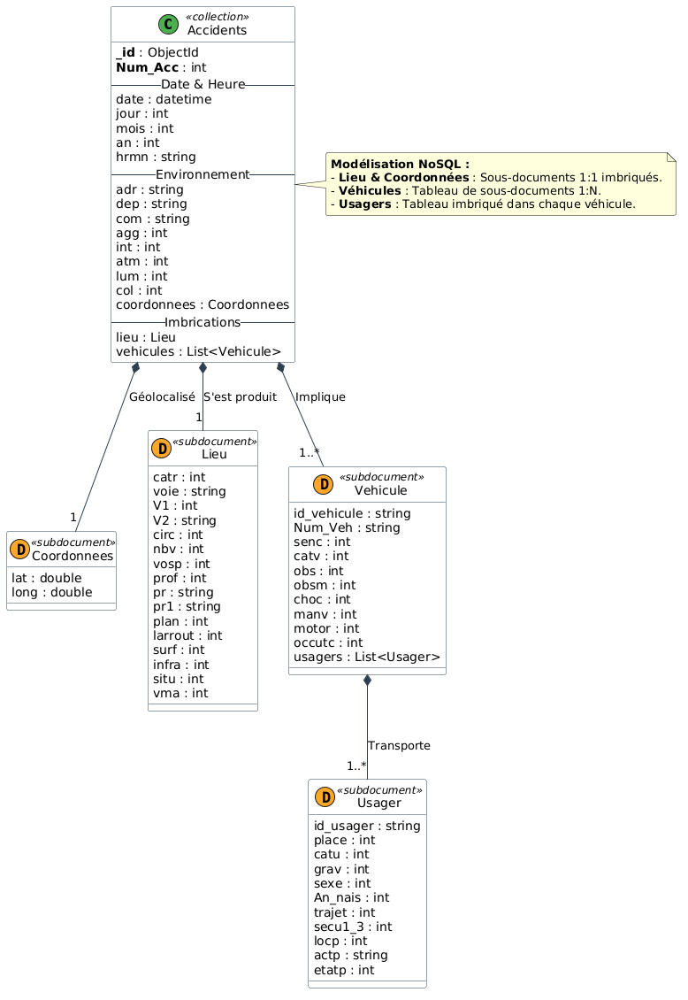

# Projet NoSQL — Architecture & Intégration MongoDB
**MIA4 · NEEKOCODE x IPSSI**

Ce projet a pour objectif de concevoir, déployer, modéliser, optimiser et exploiter une base de données NoSQL orientée documents (**MongoDB**) en s'appuyant sur des données réelles. Il combine une instance cloud managée (**MongoDB Atlas**) et un environnement de développement local (**Docker** ou natif), pilotés en **Python** à l'aide de [`uv`](https://docs.astral.sh/uv/) et `pymongo`.

---

## Sommaire

1. [Stack technique](#1-stack-technique)
2. [Prérequis](#2-prérequis)
3. [Guide d'initialisation pas-à-pas](#3-guide-dinitialisation-pas-à-pas)
   - [Étape 1 : Récupérer le projet](#étape-1--récupérer-le-projet)
   - [Étape 2 : Installer uv et l'environnement Python](#étape-2--installer-uv-et-lenvironnement-python)
   - [Étape 3 : Configurer les variables d'environnement](#étape-3--configurer-les-variables-denvironnement)
   - [Étape 4 : Démarrer l'instance MongoDB](#étape-4--démarrer-linstance-mongodb)
   - [Étape 5 : Valider l'environnement de travail](#étape-5--valider-lenvironnement-de-travail)
   - [Étape 6 : Lancer et tester le Notebook Jupyter](#étape-6--lancer-et-tester-le-notebook-jupyter)
4. [Structure du projet](#4-structure-du-projet)
5. [Commandes utiles au quotidien](#5-commandes-utiles-au-quotidien)
6. [Dépannage & Erreurs fréquentes](#6-dépannage--erreurs-fréquentes)
7. [Règles de sécurité](#7-règles-de-sécurité)

---

## 1. Stack technique

* **Base de données :** MongoDB 8.x (Cloud Atlas M0 & Conteneur Docker local)
* **Langage & Gestionnaire de paquets :** Python `>= 3.12`, géré avec [`uv`](https://github.com/astral-sh/uv)
* **Librairies Python principales :**
  * `pymongo[srv]` : driver officiel MongoDB avec résolution DNS pour Atlas
  * `python-dotenv` : chargement sécurisé des variables d'environnement
  * `ipykernel` : noyau interactif Jupyter pour l'analyse et les visualisations
* **Outils CLI MongoDB :**
  * `mongosh` : shell interactif officiel
  * `mongodb-database-tools` : utilitaires `mongoimport`, `mongoexport`, `mongodump`, `mongorestore`
* **Interface graphique (GUI) :** MongoDB Compass

---

## 2. Prérequis

Avant de démarrer l'initialisation, assurez-vous d'avoir installé sur votre machine :

### A. Le gestionnaire Python `uv`
`uv` remplace avantageusement `pip` et `venv` avec des performances optimales.

* **Linux / macOS :**
  ```bash
  curl -LsSf https://astral.sh/uv/install.sh | sh
  ```
* **Windows (PowerShell) :**
  ```powershell
  powershell -ExecutionPolicy ByPass -c "irm https://astral.sh/uv/install.ps1 | iex"
  ```
Vérifiez l'installation :
```bash
uv --version
```

### B. Les outils en ligne de commande MongoDB
Les outils CLI `mongosh` et `mongodb-database-tools` sont deux paquets distincts nécessaires pour administrer la base et exécuter le script de validation.

* **macOS (via Homebrew) :**
  ```bash
  brew install mongosh
  brew install mongodb/brew/mongodb-database-tools
  ```
* **Windows (via winget ou installeurs .msi) :**
  ```powershell
  winget install MongoDB.Shell
  ```
  Téléchargez les *Database Tools* sur le [portail officiel MongoDB](https://www.mongodb.com/try/download/database-tools).
* **Linux (Ubuntu/Debian) :**
  Installez les paquets officiels `mongodb-mongosh` et `mongodb-database-tools` via les dépôts MongoDB APT ou via les archives officielles.

Vérifiez la présence des commandes :
```bash
mongosh --version
mongoimport --version
mongodump --version
```

### C. Docker (Recommandé pour l'instance locale)
Pour faire tourner MongoDB en local sans polluer votre système hôte, Docker est la méthode la plus rapide et reproductible.

---

## 3. Guide d'initialisation pas-à-pas

### Étape 1 : Récupérer le projet

Clonez le dépôt Git et placez-vous dans le répertoire du projet :

```bash
git clone https://github.com/LeoLChalot/ipssi-nosql
cd projet
```

### Étape 2 : Installer uv et l'environnement Python

Grâce au fichier `pyproject.toml` et au fichier de verrouillage `uv.lock`, synchronisez l'environnement virtuel automatiquement :

```bash
# Crée le dossier .venv et installe toutes les dépendances verrouillées
uv sync
```

> **Note :** Si vous devez ajouter des dépendances ultérieurement, utilisez `uv add <package>` (ex: `uv add pandas matplotlib`).

### Étape 3 : Configurer les variables d'environnement

Les identifiants et chaînes de connexion ne doivent **jamais** être écrits en dur dans le code ni versionnés dans Git.

1. Créez votre fichier local `.env` ou `.env.local` en copiant le modèle fourni :
   ```bash
   cp .env.example .env.local
   # ou si vous préférez un fichier .env :
   cp .env.example .env
   ```

2. Ouvrez `.env.local` (ou `.env`) et complétez les variables :
   ```env
   # URI de connexion cloud MongoDB Atlas
   ATLAS_URI="mongodb+srv://<utilisateur>:<mot_de_passe>@cluster0.xxxxx.mongodb.net/?retryWrites=true&w=majority"

   # URI de connexion locale (Docker ou instance native)
   LOCAL_URI="mongodb://localhost:27017"
   ```

3. Assurez-vous que les fichiers `.env` et `.env.local` sont bien ignorés par Git (vérifiez que les lignes sont présentes dans `.gitignore`).

### Étape 4 : Démarrer l'instance MongoDB

Vous pouvez travailler avec une instance locale (Docker), une instance Cloud (Atlas), ou les deux.

#### Option A : Lancer MongoDB localement avec Docker (Rapide)
Exécutez la commande suivante pour démarrer un serveur MongoDB 8 avec persistance sur volume nommé :

```bash
docker run -d \
  --name mongo8 \
  -p 27017:27017 \
  -v mongo8_data:/data/db \
  mongo:8
```

Vérifiez que le conteneur tourne correctement :
```bash
docker ps
```

Commandes pour gérer le conteneur au quotidien :
```bash
docker stop mongo8   # Éteindre le conteneur
docker start mongo8  # Le redémarrer (les données sont conservées)
```

#### Option B : Configurer MongoDB Atlas (Cloud)
1. Créez un compte sur [MongoDB Atlas](https://www.mongodb.com/cloud/atlas/register).
2. Déployez un cluster gratuit **M0** (Région : AWS Frankfurt ou Paris).
3. Dans **Database Access**, créez un utilisateur (ex: `mia4`) avec le rôle `Read and write to any database` (mot de passe composé uniquement de lettres et chiffres).
4. Dans **Network Access**, autorisez l'accès depuis n'importe où avec `0.0.0.0/0`.
5. Dans **Database** > **Connect** > **Drivers**, copiez la chaîne `mongodb+srv://...` et collez-la dans la variable `ATLAS_URI` de votre `.env` / `.env.local`.

### Étape 5 : Valider l'environnement de travail

Un script de diagnostic automatisé est fourni dans [`setup/check_setup.py`](setup/check_setup.py). Il vérifie :
* La version de Python et du driver `pymongo`
* La présence dans le `PATH` des utilitaires CLI (`mongosh`, `mongoimport`, `mongodump`)
* La connectivité réseau vers vos instances MongoDB (Atlas et/ou Local)

Lancez la vérification avec `uv` :

```bash
uv run python setup/check_setup.py
```

Résultat attendu :
```text
====================================================
  MIA4 NoSQL - verification de l'environnement
====================================================
Python  : 3.14.x
pymongo : 4.17.x
OK      : mongosh trouve
OK      : mongoimport trouve
OK      : mongodump trouve
----------------------------------------------------
OK      : Atlas joignable, MongoDB 8.0.x
OK      : Local joignable, MongoDB 8.2.x
----------------------------------------------------
VERDICT : Setup complet. Vous êtes pret pour travailler.
====================================================
```

> **Attention :** Tant que le verdict n'indique pas `Setup complet`, votre environnement n'est pas finalisé. Consultez la section [Dépannage](#6-dépannage--erreurs-fréquentes) en cas de problème.

### Étape 6 : Lancer et tester le Notebook Jupyter

Le fichier [`notebook.ipynb`](notebook.ipynb) permet de tester vos connexions et d'exécuter vos analyses.

1. **Dans VS Code / Cursor :**
   * Ouvrez `notebook.ipynb`.
   * En haut à droite, sélectionnez le noyau Python situé dans l'environnement virtuel (`.venv/bin/python`).
   * Exécutez les cellules de vérification de connexion.

2. **En ligne de commande :**
   ```bash
   uv run jupyter lab
   ```

---

## 4. Structure du projet

```text
.
├── .env.example                              # Modèle pour les variables d'environnement
├── .gitignore                                # Règles d'exclusion Git (credentials, .venv, etc.)
├── pyproject.toml                            # Spécification des dépendances Python et metadata du projet
├── uv.lock                                   # Fichier de verrouillage des versions exactes de paquets
├── notebook.ipynb                            # Notebook Jupyter de travail et tests de connexion
├── urls_datasets.txt                         # Liens sources vers les jeux de données (Open Data)
├── Projet_Final_MIA4_Enonce_et_Bareme.html   # Sujet officiel, barème et attentes du projet
├── setup/                                    # Outils et documentation initiale de configuration
│   ├── check_setup.py                        # Script de validation de l'environnement
│   └── README.md                             # Guide de setup détaillé du module
└── README.md                                 # Guide d'initialisation du projet
```

---

## 5. Commandes utiles au quotidien

### Gestion de l'environnement Python
```bash
# Ajouter une dépendance au projet
uv add <nom_paquet>

# Exécuter un script Python avec les dépendances du projet
uv run python chemin/vers/script.py

# Ouvrir un shell interactif Python
uv run python
```

### Connexion en ligne de commande avec `mongosh`
```bash
# Connexion au serveur local
mongosh "mongodb://localhost:27017"

# Connexion au cluster Atlas (en utilisant la variable exportée ou le contenu du .env)
mongosh "<VOTRE_ATLAS_URI>"
```

### Outils de données (`mongoimport`, `mongodump`, `mongorestore`)
```bash
# Importer un fichier JSON composé d'un tableau d'objets
mongoimport --uri="mongodb://localhost:27017" \
            --db=mia4_db \
            --collection=elections \
            --file=data/elections.json \
            --jsonArray

# Exporter une sauvegarde BSON complète d'une base
mongodump --uri="<VOTRE_ATLAS_URI>" --out="./backups/dump_$(date +%Y%m%d)"

# Restaurer une sauvegarde
mongorestore --uri="mongodb://localhost:27017" ./backups/dump_xxx/
```

---

## Choix du schéma final (Accès dominant)

```graphql
{
  "_id": ObjectId(str),
  "Num_Acc": int,
  "date": str,
  "jour": int,
  "mois": int,
  "an": int,
  "hrmn": str,
  "lum": int,
  "dep": str,
  "com": str,
  "agg": int,
  "int": int,
  "atm": int,
  "col": int,
  "adr": str,
  "coordonnees": {
    "type": "Point",
    "coordinates": [float, float]
  },
  "lieu": {
    "catr": int,
    "voie": str,
    "circ": int,
    "nbv": int,
    "surf": int,
    "vma": int
  },
  "vehicules": [
    {
      "id_vehicule": str,
      "Num_Veh": str,
      "catv": int,
      "motor": int,
      "choc": int,
      "usagers": [
        {
          "id_usager": str,
          "place": int,
          "catu": int,
          "grav": int,
          "sexe": int,
          "An_nais": int
        }
      ]
    }
  ]
}
```

Lors de la transition des 4 tables relationnelles vers MongoDB, les questions clés étaient :

- **Quel est le modèle d'accès principal ?** Un accident est-il consulté comme une entité complète ou accède-t-on fréquemment aux usagers/véhicules isolément sans leur contexte ?
L'analyse routière nécessite presque toujours la restitution complète de la scène (lieu, météo, véhicules et victimes).

- **Quelles sont les cardinalités et la volumétrie prévisible ?** Le nombre de véhicules et d'usagers par accident risque-t-il d'exploser et d'atteindre la limite technique de 16 Mo par document BSON ?
Un accident routier implique rarement plus d'une dizaine de véhicules et quelques dizaines d'usagers. 

- **La cardinalité est strictement bornée. Quel est le coût des jointures relationnelles ($lookup) ?** Conserver 4 collections séparées impose 3 jointures consécutives à chaque lecture, ce qui dégrade fortement le débit de requêtes.

### Tableau des cardinalités

| Relation source |	Cardinalité   | Choix d'implémentation MongoDB	    | Justification |
|:----------------|:--------------|:------------------------------------|:--------------|
| Caractéristiques - Lieux |	1 - 1	| Sous-document lieu à la racine	| Évite une collection séparée tout en isolant les attributs d'infrastructure routière des données de circonstance |
| Accident - Coordonnées | 1 - 1	| Sous-document GeoJSON localisation	| Normalisation au format standard Point [long, lat] pour activer l'indexation spatiale 2dsphere.
| Accident - Véhicules	| 1 - N |	Tableau vehicules: List[Object]	| Relation 1-N à cardinalité faible : intégration directe dans le document parent sans surcharger la mémoire.
| Véhicule - Usagers | 1 - N | Tableau usagers: List[Object] imbriqué dans chaque véhicule |	Modélise la réalité physique : un usager (conducteur, passager, ou piéton heurté) est rattaché à un véhicule précis |




### Workflow de nettoyage et d'ingestion

