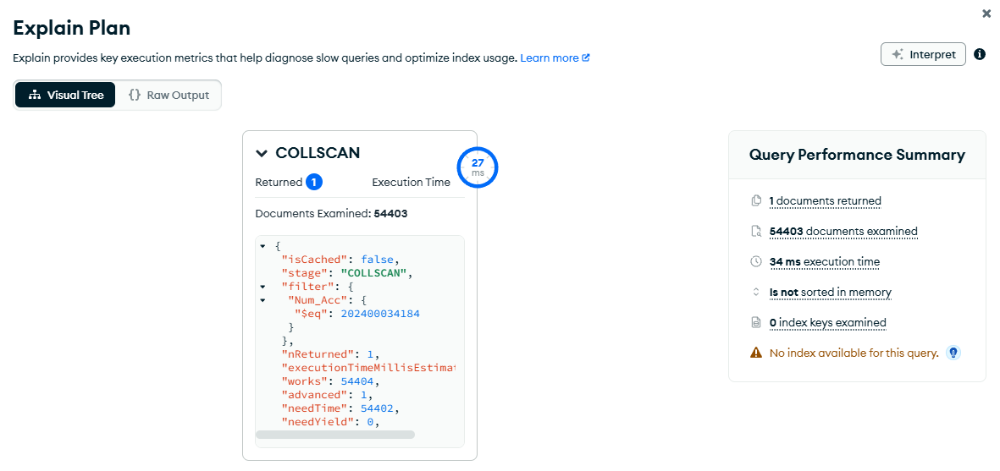
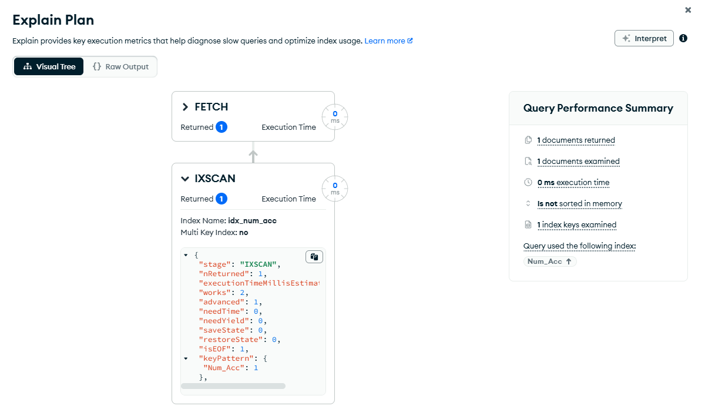
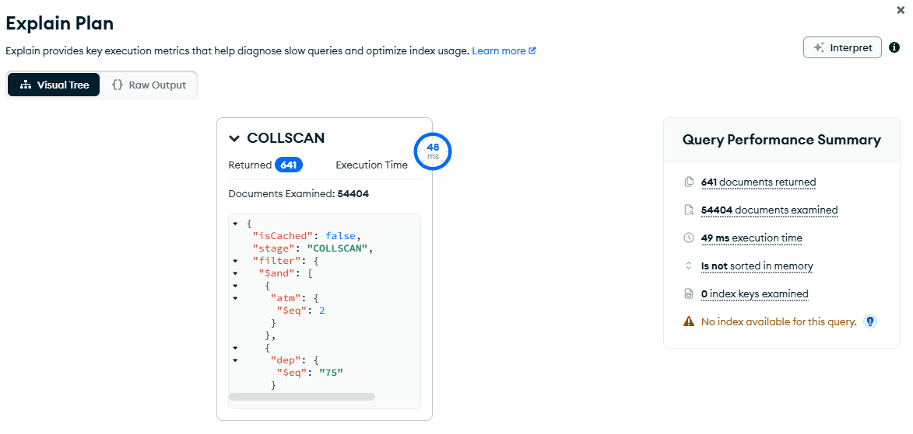
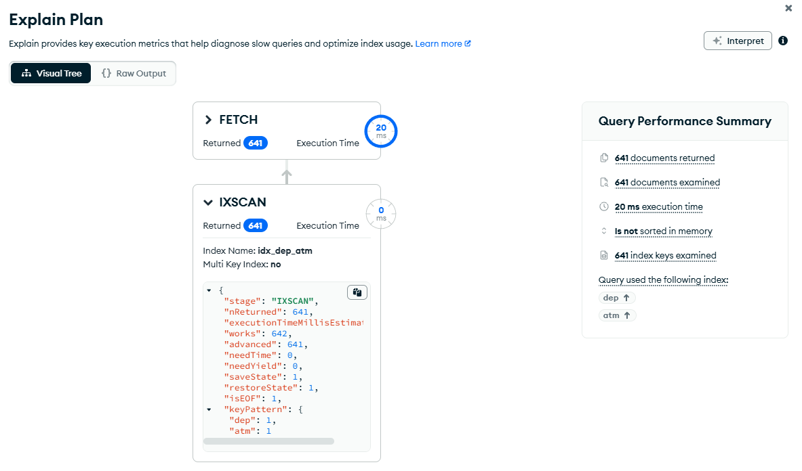
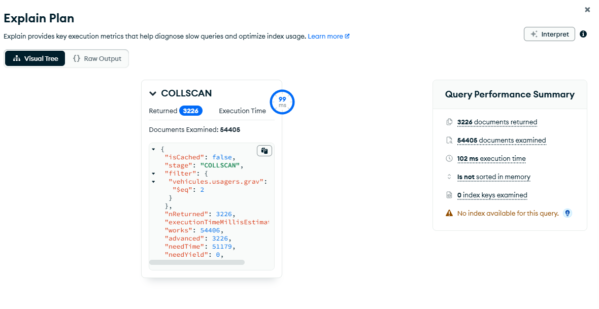
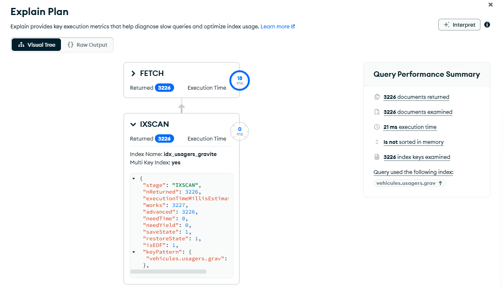

# Livrable 4 — Index justifiés et mesurés

## Méthode

Les tests sont faits sur la collection finale `securite_routiere.accidents`.

Pour comparer proprement l'avant et l'après sans supprimer les index utilisés par l'équipe, la requête est toujours la même :
- **avant** : lecture forcée sans index avec `Index Hint = { $natural: 1 }` ;
- **après** : lecture forcée avec l'index testé.

Je relève à chaque fois le plan, le nombre de documents retournés, les documents examinés, les clés d'index examinées et le temps global affiché par Compass.

---

## 1. Retrouver un accident par `Num_Acc`

### Requête

```javascript
{ Num_Acc: 202400034184 }
```

`Num_Acc` identifie l'accident et sert de lien entre les différentes rubriques BAAC avant leur regroupement dans le document final.

### Avant

Index Hint :

```javascript
{ $natural: 1 }
```

```text
Plan                    : COLLSCAN
Documents retournés     : 1
Documents examinés      : 54 403
Clés examinées          : 0
Temps                   : 34 ms
```



### Index

```javascript
{ Num_Acc: 1 }
```

Nom :

```text
idx_num_acc
```

### Après

Index Hint :

```text
"idx_num_acc"
```

```text
Plan                    : FETCH + IXSCAN
Documents retournés     : 1
Documents examinés      : 1
Clés examinées          : 1
Temps                   : 0 ms
Seeks                   : 1
```



### Pourquoi cet index

Sans index, MongoDB parcourt 54 403 documents pour en retrouver un seul. Avec l'index, il examine une clé puis récupère directement le document.

Le nombre de documents examinés baisse d'environ **99,998 %**.

Le `0 ms` affiché par Compass signifie seulement que cette exécution est sous sa granularité d'affichage. Le gain principal se voit surtout sur le passage `COLLSCAN` → `IXSCAN` et sur le nombre de documents examinés.

> Pendant les tests, l'index a été gardé non unique : la collection contenait volontairement plusieurs copies d'un même `Num_Acc` liées aux tests de l'équipe. Le livrable mesure ici la performance de lecture, pas la contrainte d'unicité.

---

## 2. Filtrer par département et météo

### Requête

```javascript
{ dep: "75", atm: 2 }
```

Ici `dep` est une chaîne. C'est volontaire : le code département doit aussi pouvoir contenir des valeurs comme `2A` et `2B`.

### Avant

Index Hint :

```javascript
{ $natural: 1 }
```

```text
Plan                    : COLLSCAN
Documents retournés     : 641
Documents examinés      : 54 404
Clés examinées          : 0
Temps                   : 49 ms
```



### Index

```javascript
{ dep: 1, atm: 1 }
```

Nom :

```text
idx_dep_atm
```

### Après

Index Hint :

```text
"idx_dep_atm"
```

```text
Plan                    : FETCH + IXSCAN
Documents retournés     : 641
Documents examinés      : 641
Clés examinées          : 641
Temps                   : 20 ms
Seeks                   : 1
```



### Pourquoi cet ordre

Les deux champs sont utilisés par égalité dans cette requête.

`dep` est placé en premier pour que le préfixe de l'index reste aussi utilisable avec une requête simple du type :

```javascript
{ dep: "75" }
```

Le nombre de documents examinés baisse d'environ **98,82 %**.

---

## 3. Accidents avec au moins un usager tué

### Requête

```javascript
{ "vehicules.usagers.grav": 2 }
```

Dans le BAAC, `grav = 2` correspond à un usager tué.

Les usagers sont imbriqués dans `vehicules[].usagers[]`. Cette requête permet donc d'exploiter directement la structure finale du document sans refaire de jointure.

### Avant

Index Hint :

```javascript
{ $natural: 1 }
```

```text
Plan                    : COLLSCAN
Documents retournés     : 3 226
Documents examinés      : 54 405
Clés examinées          : 0
Temps                   : 102 ms
```



### Index

```javascript
{ "vehicules.usagers.grav": 1 }
```

Nom :

```text
idx_usagers_gravite
```

### Après

Index Hint :

```text
"idx_usagers_gravite"
```

```text
Plan                    : FETCH + IXSCAN
Documents retournés     : 3 226
Documents examinés      : 3 226
Clés examinées          : 3 226
Temps                   : 21 ms
Seeks                   : 1
isMultiKey              : true
```



### Pourquoi cet index

Comme `vehicules` et `usagers` sont des tableaux, MongoDB crée un **index multikey**. Il peut donc indexer les valeurs `grav` présentes dans les tableaux et retrouver directement les accidents concernés.

Le nombre de documents examinés baisse d'environ **94,07 %**.

C'est aussi l'index qui dépend le plus directement de notre choix de modélisation imbriquée.

---

## Synthèse

| Index | Plan avant | Plan après | Retournés | Docs examinés avant | Docs examinés après | Réduction | Temps avant | Temps après |
|---|---|---|---:|---:|---:|---:|---:|---:|
| `idx_num_acc` | COLLSCAN | FETCH + IXSCAN | 1 | 54 403 | 1 | 99,998 % | 34 ms | 0 ms |
| `idx_dep_atm` | COLLSCAN | FETCH + IXSCAN | 641 | 54 404 | 641 | 98,82 % | 49 ms | 20 ms |
| `idx_usagers_gravite` | COLLSCAN | FETCH + IXSCAN | 3 226 | 54 405 | 3 226 | 94,07 % | 102 ms | 21 ms |

## Coût des index

Je n'indexe pas tous les champs de la collection.

Un index prend de la place et doit être mis à jour pendant les insertions ou les modifications. Je garde donc seulement des index qui correspondent à des accès qu'on utilise ou qu'on peut réellement justifier dans le projet.

---

## Code à garder dans le notebook

```python
# Num_Acc sert à retrouver rapidement un accident.
# L'index reste non unique pendant nos tests car la collection contient des doublons de test.
col_accidents.create_index(
    [("Num_Acc", 1)],
    name="idx_num_acc"
)

# On filtre aussi par département et météo.
# dep est premier pour que l'index reste utile avec {dep: ...} seul.
col_accidents.create_index(
    [("dep", 1), ("atm", 1)],
    name="idx_dep_atm"
)

# Les usagers sont imbriqués dans les véhicules.
# Cet index évite de parcourir toute la collection quand on filtre sur leur gravité.
col_accidents.create_index(
    [("vehicules.usagers.grav", 1)],
    name="idx_usagers_gravite"
)

# localisation est stocké en GeoJSON : 2dsphere sert aux recherches géographiques.
col_accidents.create_index(
    [("localisation", "2dsphere")],
    name="idx_localisation_2dsphere"
)
```
